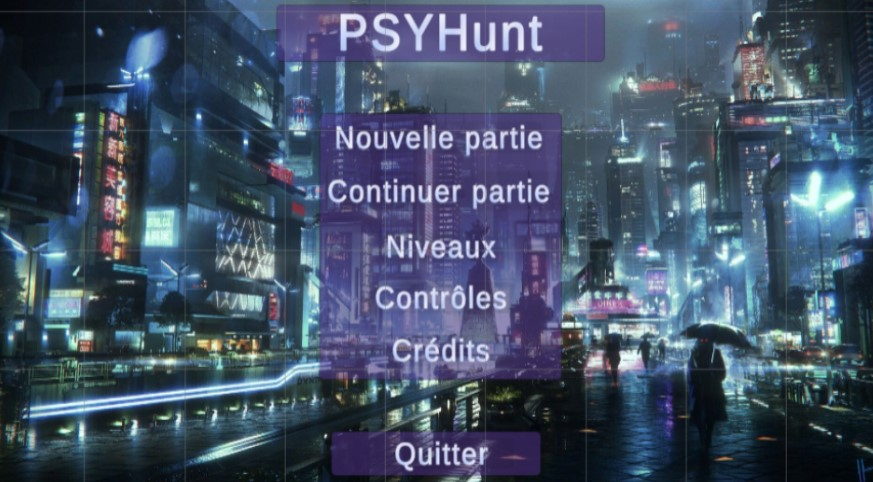
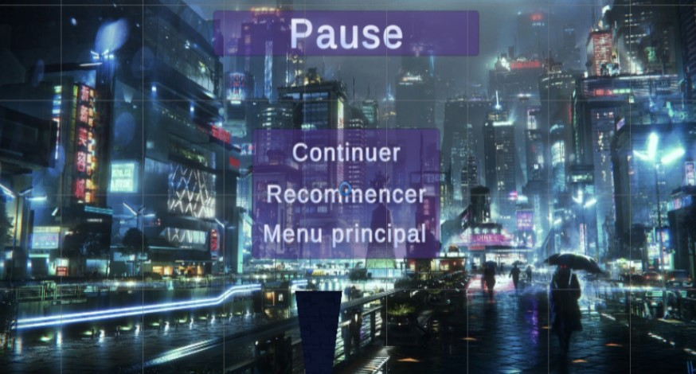
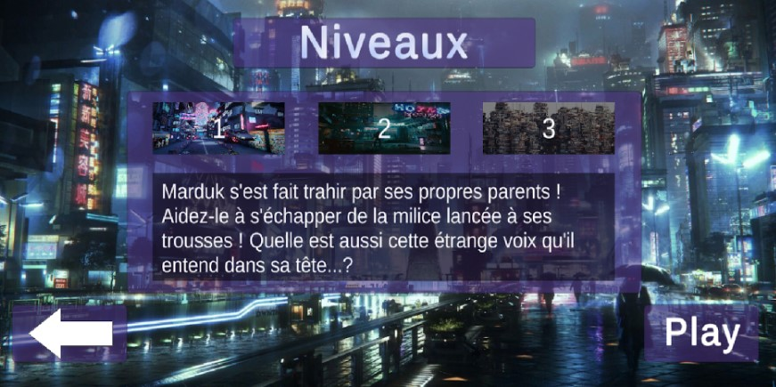
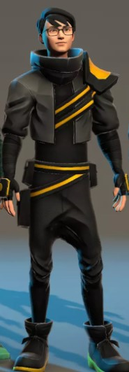
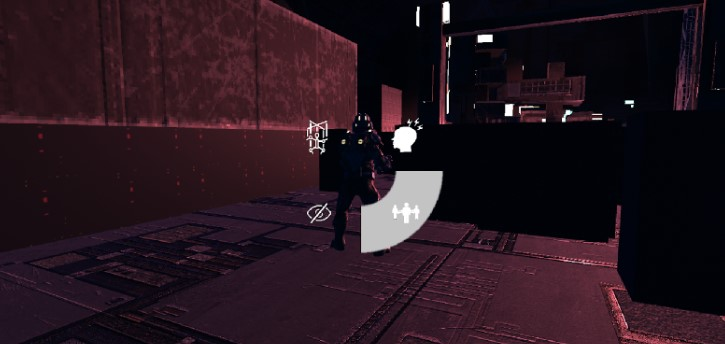
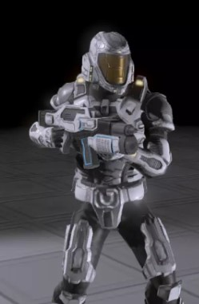
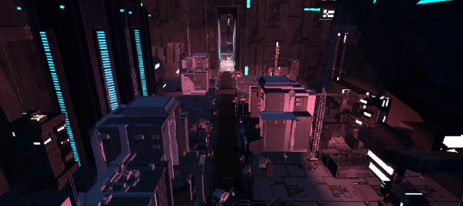

# PsyHunt 

Projet en collaboration avec : 
- Pierre Laclaverie
- Barnabé Portier
- Alexis Shan Yann
- Thomas Blomme
- Issouf OUEDRAOGO 

Pour des infos plus complètes, lire le [rapport de projet.](Ress/pdf/rapport.pdf)

Le gestionnaire de version utilisé est Perforce avec l'UQAC. Nous ne pouvons pas partager le code source mais uniquement la build, cf fin du Readme. 

Ce github sert de présentation générale pour le concept. Les documents en liens permettent une approche plus structurée. La description est volontairement épurée pour éviter de surcharger ce fichier et le rendre peu lisible.

# Objectif 

“Psy Hunt” est un jeu d’infiltration composé de plusieurs niveaux qu’il faudra compléter afin d’avancer dans l’histoire. La condition de complétion des niveaux sera bien souvent de s’enfuir d’un certain endroit : bâtiments en ruine, complexe abandonné, toits de gratte-ciel, etc… Notre jeu met l’emphase sur l’utilisation de pouvoirs psychiques, dédiés à l’infiltration, et non au combat, afin d’inciter le joueur à passer le plus possible de son temps à éviter les ennemis au lieu de les confronter directement.

Le jeu se déroulera en trois dimensions et avec une vue à la première personne. Cette décision, allant à l’encontre de la “méta” de beaucoup de jeux d’infiltration (très souvent en troisième personne) a un double objectif : celui d’apprécier au mieux les pouvoirs, et ainsi mieux les contrôler, et aussi forcer le joueur à utiliser ses pouvoirs pour réunir des informations sur son environnement et ses ennemis. 

Pour plus d'informations, voici le [Document de Game Design.](Ress/pdf/GDD.pdf)

# Rendu 

Pour l'élaboration de ce prototype, nous avons eu le temps d'implémenter les principales mécaniques du jeu qui sont : se déplacer, éliminer un ennemis, les patrouilles ennemies, la détection du personnage principal par les ennemis, l'utilisation du pouvoir d'invisibilité et du controle des animaux environnant.

## Menu 

Voici la présentation des différents menus du jeu 

## ingame
Personnage principal : Marduk

Sélection des pouvoirs: 

Un des types d'ennemis, la sentinelle, statique.

Vue d'ensemble du premier niveau :

Pour l'immersion du joueur, nous avons créé un [Trailer Vidéo](https://drive.google.com/file/d/1qnwtUZi7F5SaIj2yIF_ALonA2mIYjX64/view?usp=sharing).

Une [build](https://drive.google.com/file/d/1gsdGnWgqK7wP7w03K80GbLTubdxLCUdA/view?usp=sharing) est téléchargeable.

